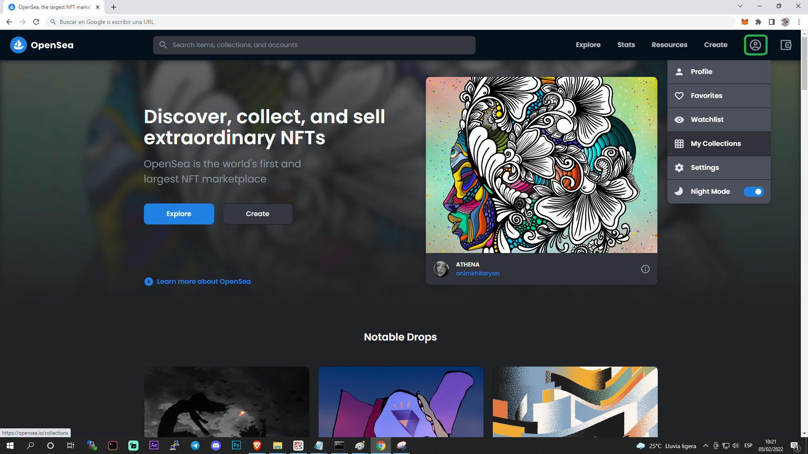

<h1 align ="center"> Bulkdozer</h1>

    

 

<em>Prepare your servers OpenSea! <b>#EverybodyStandBack</b></em>

 

## Overview

Imagine that you were able to replicate the efficiency of uploading a big collection of NFTs with its corresponding metadata to a marketplace like <a href="https://opensea.io/">OpenSea</a>, just like <a href ="https://opensea.io/collection/boredapeyachtclub">The Bored Ape Yacht Club</a> and <a href ="https://opensea.io/collection/cryptopunks">Cryptopunks</a> have done in the past.

**You would be saving a lot of time and avoiding headaches if that were possible!** 😎
  
  ><em><h4>Interesting, but I've heard that it requires to know a lot about Smart Contracts, Solidity and other geek stuff to do so...🤔</h4></em> 
  
Fortunately that's not exactly the case ***IF you have created a collection of NFTs using*** <a href ="https://github.com/noahverner1995/SAND-wich">***SAND-wich***</a> 🥪😉.

<a href ="https://github.com/noahverner1995/SAND-wich">**SAND-wich**</a> is another open-source project that is useful for making simple NFT collections that require merging any number of 2d layers following an specific order (provided by you), as well as the corresponding metadata used in the process. 

Once you have created your NFT collection with **SAND-wich**, and also read this guide, you will be ready for starting <a href ="https://github.com/noahverner1995/Bulkdozer/blob/main/exe/bulkdozer.exe">**The Bulkdozer**</a> 🚛.
  
  ><em><h3>That's cool, what do I need to know? 🤷‍♂️</h3></em> 

I'm glad you ask!
  
Essentially you must know that after having logged in to your OpenSea account, and created the corresponding NFT collection in which you desire to upload your NFTs, you will start **The Bulkdozer**, which will ask you for some inputs, for then taking limited control of your Chrome Browser for doing an automated process, until it completely finishes uploading your NFTs (including the metadata).

**There are several conditions you need to meet and maintain if you want this program to run as good as expected**, these ones will be shown further below in this guide.
  
By now, let's start mentioning a summary of the technology this program uses 🤖:

  - **Technology stack**: Python 3.9.6 [MSC v.1929 64 bit (AMD64)], Pandas 1.3.1, Selenium 4.1.0, NumPy 1.21.1, PyAutoGUI 0.9.53.
  - **Status**:  0.1.0
  - **Executable**: https://github.com/noahverner1995/Bulkdozer/blob/main/exe/bulkdozer.exe
  - **What makes this software different from others?** The ease of use, the brand concept behind it, and the added value it provides to the collections created with **SAND-wich**.

## Installation

**If you are a developer**, you will first have to have installed `Python 3.9.6` or later with the following dependencies: `Pandas 1.3.1` or later, `Selenium 4.1.0` or later, `NumPy 1.21.1` or later, `PyAutoGUI 0.9.53` or later. Then you can copy the code from the `bulkdozer.py` file and run it in your preferred environment.
    
**If you ARE NOT a developer**, you will first have to deactivate your Antivirus for then <a href ="https://github.com/noahverner1995/Bulkdozer/blob/main/exe/bulkdozer.exe">downloading the exe file</a>. Then you can execute the program by clicking on it and pressing ↵Enter.

## Usage

First of all, you will open `Chrome Browser` using <a href="https://chromedevtools.github.io/devtools-protocol/">**DevTools as protocol client**</a>. This is a mandatory condition since it's the only way (at least known by me so far) to properly let a program take control of a `Chrome Browser` instance with `Selenium` while also **AVOIDING triggering Cloudflare DDoS protection** as shown below:

(Btw, ***keep in mind that you can only have 1 Chrome Instance (window) open when doing this process***, so if you want to keep reading this guide while also running the **The Bulkdozer**, I encourage you to read this guide in a different device (i.e. Your phone or another PC) and start **The Bulkdozer** in your regular PC)

 

   

<em>If you see this when trying to automate a process in a webpage,</em>

<em>it means you DID NOT run Chrome Browser with DevTools protocol enabled</em>

 

Don't worry, it's not difficult, just go the **Windows Search Bar**, type "chrome", find the Application option, right-click it, and select `Open file location` as shown below:

    

It will open a folder containing all of the corresponding executable files your `Start Menu` has, now you will right-click again the `Google Chrome` executable file and select `Open file location` as shown below:

 

   

 

Okay, now you will copy the path of the current folder (and paste it in a temporary `.txt` or `.docx` file) as shown below:

 

   

 

Now, you will run the regular `Chrome Browser` but just to get the `user-data-dir`, type `chrome://version/` in the URL bar, as shown below:

 

   

 

Copy that path (and paste it in the same temporary `.txt` or `.docx` file previously created), then close the regular `Chrome Browser` you have open.

All right now, you are going to run `Chrome Browser` with **DevTools protocol enabled**, go to the **Windows Search Bar**, type "cmd" and open the first option that appears, then type `cd` followed by 1 `Space tab` and then the first path you previously copied, then press ↵Enter as shown below:

 

   

 

Okay, now type `chrome.exe --remote-debugging-port=9222 --user-data-dir:` followed by the second path you copied previously inside quotation marks (`""`), then press ↵Enter as shown below: 

 

   

 

All right, it will open a **Chrome instance** (window) like this one down below:

 

   

<em>Make sure to check if this Chrome instance has the Metamask extension installed.</em>

<em>Else, you will have to install it manually, like the first time 🤷‍♂️</em>

 

So now you will log in to your wallet to check if it has the **Polygon Mainnet** set as the one to use in OpenSea, as shown below:

 

   

<em>If you HAVE NOT set the Polygon Mainnet yet, go to this <a href="https://support.polkastarter.com/article/18-how-to-add-polygon-matic-network-to-metamask">link</a>.</em>

<em>And follow the instructions provided to manually add the Polygon Network to your wallet 👨‍💻</em>

<em>Then, change the Ethereum Mainnet (or whatever Mainnet you currently have) for Polygon's one 💻</em>

 

All right, now you will go to the <a href="https://opensea.io/">OpenSea main page</a> as shown below:

 

   

 

Now you will move your mouse to the account button (👤) and click on "My Collections" button, as shown below:

 

   

 

Then, it will load a page that will ask you to connect your wallet, as shown below:

 

   

 

You will connect your wallet, and then the website will show you the collections you have created so far:

 

   

 

Now you will click on "Create a collection" button to create one if you haven't done it yet, else you will pick the collection you want to update, and then click on "Add item" button as shown below: 

 

   

 

<h4 align="center">🔻🔻THE FOLLOWING STEP MUST ONLY BE DONE ONCE IF THIS IS YOUR VERY FIRST TIME UPLOADING AN NFT TO OPENSEA🔻🔻</h4>

You will upload your first NFT manually once done, you will click on "Sell" button to set a price for that NFT you just uploaded.

 

   

 

In order to set a price in any of the cryptocurrencies allowed as a payment method on OpenSea, you must first submit a transaction with your wallet to trade with a particular cryptocurrency as explained <a href ="https://youtu.be/wOCcsGNtpqc?t=502">in this part of this video</a>, this process must be done once per cryptocurrency, but if you have already done this before, skip this step.

<h4 align="center">🔺🔺THE STEP ABOVE MUST ONLY BE DONE ONCE IF THIS IS YOUR VERY FIRST TIME UPLOADING AN NFT TO OPENSEA🔺🔺</h4>

Now, you will have to download `chromedriver` (if you haven't done it before) from <a href="https://chromedriver.chromium.org/">this page</a>, you will click the latest stable release, then you will download the file with the name "**chromedriver_win32.zip**", this will be used by **The Bulkdozer** to take control of your Chrome Browser, once downloaded you will unzip that file, then right-click it and select "Properties".

 

   

 

Then you navigate to the "Security" tab, and copy the path from this file (and save it in a new `.txt` or `.docx` file).

<h3 align="center">🏴🏴🏴All right, from this point you are now ready to start The Bulkdozer! 🏴🏴🏴</h3>
 

You will download the `bulkdozer.exe` file from <a href="https://github.com/noahverner1995/Bulkdozer/blob/main/exe/bulkdozer.exe">here</a> and save it in your desired location.

Once done, you will click it and press ↵Enter as shown below:

 

   

 

Now, I will explain the variables to use:

🟪 **Item Name**: This variable stores the name that will be shared by every single NFT in your collection. 
🟪 **External link**: This variable stores the link to your website in which users can know more about your collection (raodmap, partnerships, etc). 
🟪 **Description**: This variable stores a text that will be shared by every single NFT in your collection (similar to the Item Name variable). 
🟪 **Collection link**: This variable stores the link to your collection in which you desire to upload your NFTs. 
🟪 **Start number**: This variable stores the first NFT to upload from your collection. 
🟪 **End number**: This variable stores the last NFT to upload from your collection. 
🟪 **Payment method**: This variable let you choose the payment method, only ETH or DAI supported. 
🟪 **Initial price**: This variable stores the initial price your NFTs will have, it supports decimals points (e.g. 7.5 or 0.05128). 
🟪 **NFT Folder path**: This variable stores the path at which your NFTs are located. 
🟪 **Metadata File path**: This variable stores the path at which the Metadata file is located (usually within the same NFT Folder). 

Okay, before you start typing anything, I recommend you to create a temporary `.txt` or `.docx` file in which you will type the information to pass as input to **The Bulkdozer**, as shown below:

 

   

 

><em><h3>NOTES:</h3></em> 
>
>⭕ It is recommended that you set both **Start number** and **End number** proportionally to the size of your collection, but **DO NOT ABUSE** the total number of requests you ask to the OpenSea's server, ***the greater the difference between the Start number and End number, the greater the number of requests you are going to ask to OpenSea's server, resulting in getting many 503 errors.***
>
>⭕ You can get the Metadata File path the same way you got the path to the `chromedriver` you downlodaded and unzipped, reread the part of this guide that explains the `chromedriver` stuff
